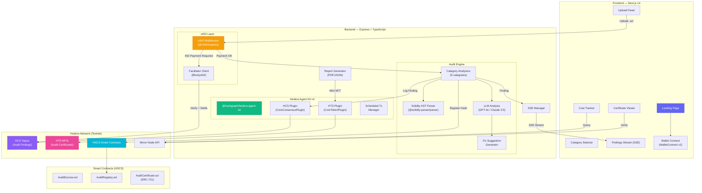
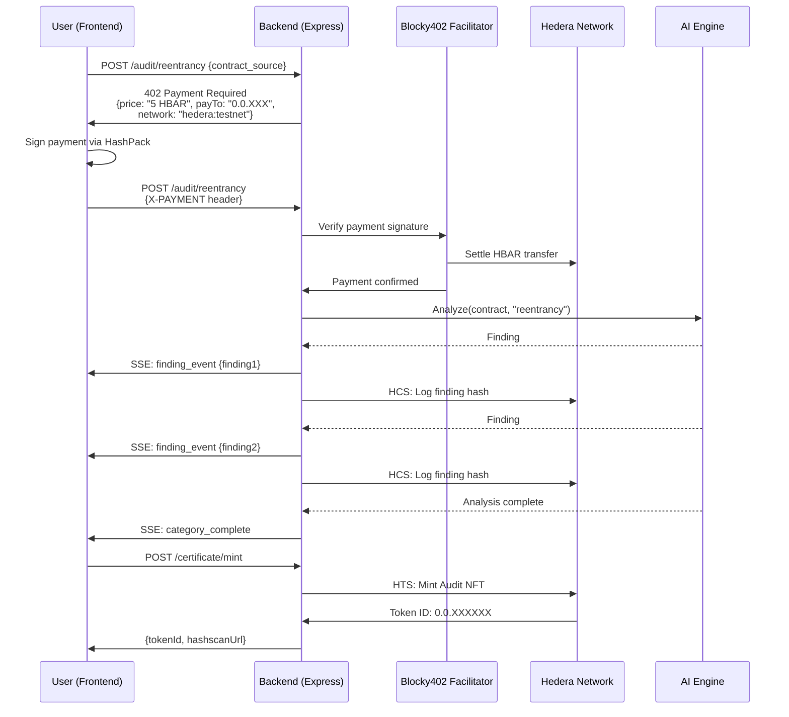

# AegisHBAR

**Pay-Per-Audit Smart Contract Security Agent on Hedera**

An AI-powered smart contract security auditor where developers pay only for the vulnerability categories they need via x402 micropayments. Every finding is anchored immutably on HCS, and audit certificates are minted as transferable NFTs via HTS.

---

## Table of Contents

- [Overview](#overview)
- [Live Demo](#live-demo)
- [Key Features](#key-features)
- [Architecture](#architecture)
- [Audit Categories and Pricing](#audit-categories-and-pricing)
- [User Flow](#user-flow)
- [Tech Stack](#tech-stack)
- [Smart Contracts](#smart-contracts)
- [Getting Started](#getting-started)
  - [Prerequisites](#prerequisites)
  - [Installation](#installation)
  - [Environment Configuration](#environment-configuration)
  - [Running Locally](#running-locally)
- [Testing](#testing)
- [Deployment](#deployment)
- [Project Structure](#project-structure)
- [Hedera Integration Details](#hedera-integration-details)
- [x402 Payment Protocol](#x402-payment-protocol)
- [API Reference](#api-reference)
- [Contributing](#contributing)
- [License](#license)
- [Acknowledgments](#acknowledgments)

---

## Overview

AegisHBAR is a pay-per-scan smart contract security auditor built for the Hedera ecosystem. It replaces flat-fee audit pricing with granular x402 micropayments, allowing developers to select and pay for only the security categories relevant to their contract.

The platform combines deterministic static analysis with LLM-powered deep reasoning to produce actionable findings, each of which is logged to the Hedera Consensus Service for tamper-evident auditability. Upon completion, an Audit Certificate NFT is minted via the Hedera Token Service as verifiable, transferable proof of audit.

**What makes AegisHBAR different:**

- Fully Hedera-native from end to end — HCS audit trails, HTS certificate NFTs, HSCS escrow contracts.
- Pay-per-category pricing via x402 — no subscriptions, no flat fees.
- Real-time findings streamed via SSE with severity classification.
- AI-generated fix suggestions alongside every vulnerability found.
- Transferable Audit Certificate NFTs that projects can showcase to investors and users.

---

## Live Demo

| Resource | Link |
|:--|:--|
| Web Application | [aegishbar.vercel.app](https://aegishbar.vercel.app) |
| Deployed Contracts | [Hashscan (Testnet)](https://hashscan.io/testnet) |

---

## Key Features

### Pay-Per-Category Micropayments
Each security analysis category is a separate x402-gated endpoint. Developers pay in HBAR or USDC only for the scans they need. A full audit bundle is available at a 20% discount.

### Real-Time Findings Stream
Findings are streamed to the frontend in real time via Server-Sent Events. Each finding includes a severity badge, the vulnerable code snippet, a detailed explanation, and an AI-generated fix suggestion.

### Immutable Audit Trail (HCS)
Every finding is hashed and submitted as a JSON message to a dedicated Hedera Consensus Service topic. This creates a tamper-evident, publicly verifiable audit record queryable via the Hedera Mirror Node.

### Audit Certificate NFTs (HTS)
Upon completion, a non-fungible token is minted via the Hedera Token Service containing the full audit metadata: contract hash, findings summary, HCS topic reference, severity counts, and timestamp. The NFT is transferable and verifiable by anyone.


### AI-Powered Fix Suggestions
For every vulnerability detected, the agent generates a patched code suggestion showing exactly how to remediate the issue, presented in a diff view alongside the original code.

---

## Architecture



### x402 Payment Flow



---

## Audit Categories and Pricing

| Category | HBAR | USDC | Description |
|:--|:--|:--|:--|
| Reentrancy Analysis | 5 | $0.05 | State mutation ordering, cross-function reentrancy, read-only reentrancy |
| Access Control Review | 3 | $0.03 | Role enforcement, privilege escalation, missing modifiers |
| Integer Overflow Check | 2 | $0.02 | Arithmetic safety, unchecked blocks, casting issues |
| Gas Optimization | 3 | $0.03 | Storage patterns, loop efficiency, redundant operations |
| Business Logic Audit | 8 | $0.08 | Domain-specific logic flaws, edge cases, economic exploits |
| **Full Audit Bundle** | **15** | **$0.15** | **All categories at 20% discount** |
| Certificate NFT Mint | 2 | $0.02 | On-chain proof of audit |

---

## User Flow

**Step 1 — Connect Wallet**
Connect a MetaMask wallet configured for the Hedera Testnet. The application supports HBAR payments via the x402 standard over EVM.

**Step 2 — Upload Contract**
Paste Solidity source code or upload a `.sol` file. The parser analyzes the contract and displays metrics: line count, function count, complexity score, and detected patterns.

**Step 3 — Select Categories**
Choose individual audit categories or select the full audit bundle. A cost tracker displays the running total in real time.

**Step 4 — Pay and Execute**
Click "Start Audit." Each selected category triggers an x402 payment flow: the backend responds with HTTP 402, the wallet signs the payment, and analysis begins immediately upon settlement. Findings stream into the UI in real time.

**Step 5 — Review Findings**
Each finding displays a severity badge, the vulnerable code snippet, an explanation, and an AI-generated fix suggestion. Every finding includes a "View on Hashscan" link to its HCS record.

**Step 6 — Mint Certificate**
After the audit completes, mint an Audit Certificate NFT in one click. The NFT appears in the connected wallet and can be shared via a public link with a QR code.

---

## Tech Stack

### Frontend
| Technology | Purpose |
|:--|:--|
| Next.js 14 (App Router) | React framework with server components |
| TypeScript | Type-safe development |
| Tailwind CSS | Utility-first styling |
| Framer Motion | Animations and transitions |
| Zustand | Client-side state management |
| MetaMask | Wallet integration via standard EVM injected provider |

### Backend
| Technology | Purpose |
|:--|:--|
| Express.js | HTTP server and routing |
| TypeScript | Type-safe development |
| Hedera Agent Kit v4 | HCS, HTS, and account operations |
| x402 (`@x402/express`) | Payment middleware |
| @solidity-parser/parser | Solidity AST generation |
| OpenAI / Anthropic SDK | LLM-powered security analysis |
| Ethers.js v6 | ABI encoding, hashing, contract interaction |
| Zod | Runtime request validation |

### Smart Contracts
| Technology | Purpose |
|:--|:--|
| Solidity 0.8.24+ | Contract language |
| Foundry | Compilation, testing, deployment |
| OpenZeppelin Contracts v5 | ERC-721, ReentrancyGuard, Ownable |

### Infrastructure
| Technology | Purpose |
|:--|:--|
| Vercel | Frontend hosting |
| Railway | Backend hosting |
| Hedera Testnet | Blockchain network |
| Turborepo | Monorepo task orchestration |
| GitHub Actions | CI/CD pipeline |

---

## Smart Contracts

All contracts are deployed on Hedera Testnet via the Hedera Smart Contract Service (HSCS).

### AuditEscrow.sol

Manages prepaid audit budgets with automatic timeout refunds.

| Function | Description | Access |
|:--|:--|:--|
| `deposit(timeoutSeconds)` | Create an escrow deposit with HBAR | Public |
| `consumePayment(depositId, category, amount)` | Deduct cost for a completed category scan | Agent only |
| `refund(depositId)` | Return unused balance after timeout | Depositor |
| `getDeposit(depositId)` | View deposit details | Public |

### AuditRegistry.sol

On-chain registry mapping audit sessions to finding hashes and HCS topic IDs.

| Function | Description | Access |
|:--|:--|:--|
| `startAudit(contractHash, hcsTopicId)` | Initialize an audit session | Agent only |
| `recordFinding(auditId, findingHash)` | Store the keccak256 hash of a finding | Agent only |
| `finalizeAudit(auditId)` | Lock the audit — no further findings accepted | Agent only |
| `verifyFinding(auditId, index, findingHash)` | Verify a finding hash matches the on-chain record | Public |

### AuditCertificate.sol

ERC-721 compliant NFT contract for audit certificates.

| Function | Description | Access |
|:--|:--|:--|
| `mintCertificate(recipient, tokenURI, metadata)` | Mint an audit certificate NFT | Agent only |
| `getCertificateMetadata(tokenId)` | Retrieve structured certificate data | Public |
| `tokenURI(tokenId)` | Returns metadata JSON URI | Public |

### Deployed Addresses (Testnet)

| Contract | Address |
|:--|:--|
| AuditEscrow | `0.0.XXXXXX` |
| AuditRegistry | `0.0.XXXXXX` |
| AuditCertificate | `0.0.XXXXXX` |
| HCS Audit Topic | `0.0.XXXXXX` |
| HTS Certificate Token | `0.0.XXXXXX` |

---

## Getting Started

### Prerequisites

- Node.js v20 or later
- npm v10 or later
- Foundry (for smart contract development)
- A Hedera Testnet account ([portal.hedera.com](https://portal.hedera.com))
- HashPack wallet with testnet HBAR
- OpenAI or Anthropic API key
- WalletConnect Project ID ([cloud.walletconnect.com](https://cloud.walletconnect.com))

### Installation

```bash
# Clone the repository
git clone https://github.com/YOUR_USERNAME/aegishbar.git
cd aegishbar

# Install dependencies for all packages
npm install

# Install Foundry (if not already installed)
curl -L https://foundry.paradigm.xyz | bash
foundryup

# Install contract dependencies
cd contracts
forge install
cd ..
```

### Environment Configuration

Copy the example environment file and populate it with your credentials:

```bash
cp .env.example .env
```

Required variables:

```bash
# Hedera Testnet Credentials (Agent Identity)
HEDERA_ACCOUNT_ID=0.0.xxxxx
HEDERA_PRIVATE_KEY=your_ecdsa_private_key_here
HEDERA_NETWORK=testnet

# Smart Contracts (HTS & HSCS)
AUDIT_ESCROW_ADDRESS=0x...
AUDIT_REGISTRY_ADDRESS=0x...
AUDIT_CERTIFICATE_TOKEN_ID=0.0.xxxxx

# Hedera Consensus Service
HEDERA_HCS_TOPIC_ID=0.0.xxxxx

# AI Provider Keys
OPENAI_API_KEY=sk-proj-...

# IPFS Pinning (Pinata)
PINATA_API_KEY=
PINATA_SECRET_API_KEY=

# x402 Payment Facilitator
X402_FACILITATOR_URL=https://x402.org/facilitator

# Frontend (.env.local for the /frontend directory)
NEXT_PUBLIC_BACKEND_URL=http://localhost:3001
NEXT_PUBLIC_HEDERA_NETWORK=testnet
```

See `.env.example` for the complete list of configuration options.

### Running Locally

```bash
# Start all services (frontend + backend)
npm run dev

# Or start individually:
cd backend && npm run dev    # Backend on port 3001
cd frontend && npm run dev   # Frontend on port 3000
```

### Compiling and Deploying Contracts

```bash
cd contracts

# Compile
forge build

# Run tests
forge test -vvv

# Deploy to Hedera Testnet
forge script script/Deploy.s.sol --rpc-url https://testnet.hashio.io/api --broadcast
```

---

## Testing

### Smart Contracts

```bash
cd contracts
forge test -vvv                    # Run all tests with verbose output
forge test --match-test testDeposit # Run specific test
forge coverage                     # Generate coverage report
```

### Backend

```bash
cd backend
npm run test                       # Run unit tests
npm run test:coverage              # Run with coverage
npm run test:integration           # Run integration tests
```

### Frontend

```bash
cd frontend
npm run test                       # Run component tests
npm run e2e                        # Run Playwright E2E tests
```

### Full Suite

```bash
# From project root
npm run test                       # Run all tests across all packages
```

---

## Deployment

### Frontend (Vercel)

The frontend deploys automatically from the `main` branch via Vercel.

```bash
# Manual deployment
cd frontend
npx vercel --prod
```

### Backend (Railway)

The backend runs as a containerized Express application on Railway.

```bash
# Build the Docker image
docker build -t aegishbar-backend ./backend

# Deploy via Railway CLI
railway up
```

### Environment Notes

- The backend must be accessible over HTTPS for x402 payment headers to function correctly.
- CORS is configured to allow requests only from the frontend origin.
- All Hedera interactions target testnet. Switching to mainnet requires only environment variable changes.

---

## Project Structure

```
aegishbar/
├── frontend/              Next.js 14 application
│   ├── src/
│   │   ├── app/           App Router pages
│   │   ├── components/    React components
│   │   ├── hooks/         Custom React hooks
│   │   ├── lib/           Utilities and API client
│   │   └── stores/        Zustand state stores
│   └── public/            Static assets
│
├── backend/               Express.js API server
│   └── src/
│       ├── config/        Environment and Hedera setup
│       ├── middleware/    x402, auth, rate limiting
│       ├── routes/        API route handlers
│       ├── services/      Core business logic
│       │   └── categories/  Per-category analyzers
│       ├── agents/        Agent Kit orchestration
│       ├── types/         TypeScript type definitions
│       └── utils/         Shared utilities
│
└── contracts/             Solidity smart contracts
    ├── src/               Contract source files
    ├── test/              Foundry test suites
    └── script/            Deployment scripts
│
├── .github/workflows/         CI/CD pipeline
├── .env.example               Environment template
├── turbo.json                 Turborepo configuration
└── package.json               Root workspace configuration
```

---

## Hedera Integration Details

### Hedera Consensus Service (HCS)

Every audit finding is submitted as a JSON message to a dedicated HCS topic. The message schema:

```json
{
  "version": "1.0",
  "contract": "MyContract",
  "sourceHash": "0xabcdef...",
  "reportHash": "0xabcdef...",
  "timestamp": 1717200000000,
  "summary": {
    "critical": 1,
    "high": 0,
    "medium": 2,
    "low": 0,
    "informational": 5,
    "total": 8
  },
  "riskScore": 59
}
```

Each message is publicly verifiable via the Hedera Mirror Node and Hashscan.

### Hedera Token Service (HTS)

Audit Certificate NFTs are minted as non-fungible tokens on HTS. Each token carries metadata including:

- Contract hash (keccak256 of the audited source code)
- Findings summary (count by severity)
- HCS topic ID (link to the full audit trail)
- Audit timestamp and agent identifier

### Hedera Smart Contract Service (HSCS)

Three Solidity contracts deployed on Hedera's EVM-compatible layer provide on-chain escrow management, finding hash registration, and ERC-721 certificate minting.

---

## x402 Payment Protocol

AegisHBAR uses the x402 payment standard to gate each audit category behind a micropayment. The flow:

1. The client sends a request to a protected endpoint (e.g., `POST /api/audit/reentrancy`).
2. The server responds with HTTP 402 and a `X-PAYMENT-REQUIRED` header containing the price, recipient address, and network identifier.
3. The client signs a payment authorization via the connected wallet.
4. The client retries the request with an `X-PAYMENT` header containing the signed payment.
5. The server forwards the payment to the Blocky402 facilitator for on-chain settlement.
6. Upon confirmation, the server executes the analysis and streams findings.

This enables true pay-per-use pricing without accounts, subscriptions, or API keys.

---

## API Reference

### Endpoints

| Method | Path | Auth | Description |
|:--|:--|:--|:--|
| `POST` | `/api/audit` | x402 (Variable based on selected categories) | Create a new audit session and trigger analysis |
| `GET` | `/api/audit/stream/:depositId` | None | SSE stream of findings |
| `GET` | `/api/certificate/:tokenId` | None | Retrieve certificate metadata and details |
| `GET` | `/health` | None | Service health check |

### Request: Start Audit

```json
POST /api/audit
Content-Type: application/json

{
  "sourceCode": "// SPDX-License-Identifier: MIT\npragma solidity ^0.8.24;\n...",
  "categories": ["reentrancy", "access"],
  "depositId": "0x123abc...",
  "depositor": "0x456def..."
}
```

### Response: Start Audit

```json
{
  "success": true,
  "depositId": "0x123abc..."
}
```

### SSE Event Types

| Event | Description |
|:--|:--|
| `finding` | A new vulnerability finding |
| `category_complete` | A category scan has finished |
| `audit_complete` | All selected categories are done |
| `error` | An error occurred during analysis |

---

## Contributing

Contributions are welcome. Please read [CONTRIBUTING.md](CONTRIBUTING.md) before submitting a pull request.

1. Fork the repository.
2. Create a feature branch: `git checkout -b feature/my-feature`.
3. Commit your changes with clear, descriptive messages.
4. Push to your fork and open a pull request against `main`.
5. Ensure all CI checks pass before requesting review.

### Development Guidelines

- Follow the existing TypeScript and Solidity code style (ESLint + Prettier).
- Write tests for all new functionality.
- Keep commits atomic and well-described.
- Update documentation for any user-facing changes.

---

## License

This project is licensed under the MIT License. See [LICENSE](LICENSE) for details.

---

## Acknowledgments

- [Hedera](https://hedera.com) — Hashgraph consensus network and developer tooling.
- [Hedera Agent Kit](https://github.com/hashgraph/hedera-agent-kit-js) — Agent framework for HCS, HTS, and Hedera operations.
- [x402 Protocol](https://x402.org) — Internet-native payment standard.
- [Blocky402](https://blocky402.com) — x402 facilitator for Hedera.
- [OpenZeppelin](https://openzeppelin.com) — Audited smart contract libraries.
- Built for the [Hedera Hello Future: Apex Hackathon 2026](https://hedera.com/hackathon).
